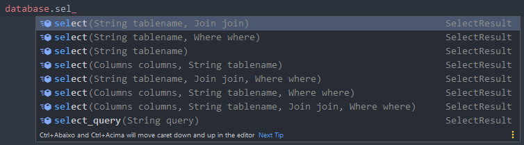
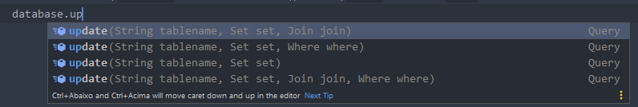

# DatabaseFramework
Framework desenvolvida para facilitar o uso de conexão com banco de dados mysql, a mesma se encontra ainda em desenvolvimento e manutenção, sugestões e reporte de bugs são muito bem vindos.
<br>Para utilizá-la é simples, basta criar conexão com banco de dados utilizando a seguinte forma

```java 
SQLConnectionBuilder.addConnections(
new SQLConnection("default", "test", "localhost", 3306, "root", "")
);
```

Por parâmetro pode ser passado quantas conexões desejar, por padrão a selecionada automaticamente será sempre a primeira conexão do parâmetro, feito isso já
podemos criar nossa instância do nossa classe onde será realizado nossas query da seguinte forma.

```java
database = new SQL();
```
O construtor SQL aceita um argumento que será o nome da conexão que deseja selecionar, as mesmas conexões que criamos logo acima, caso nenhum argumento
for passado ela selecionará por padrão a primeira conexão criada. <br>
Salve essa variável, pois através dela poderemos criar nossas query.

**Exemplo de insert**
```java 
database.insert("user",
    new Values()
        .value("nome", "Carlos")
        .value("email", "carlos.eduardovieiraoliveira12@gmail.com")
        .value("idade", 21)
);
```

**Exemplo de select**
```java
List<Map<String, Object>> result = database.select("user", new Where().where("nome", "Carlos")).map();
if(result.size() > 0)
    for (Map<String, Object> r : result){
        System.out.println("");
        System.out.println(" Nome > " + r.get("nome"));
        System.out.println(" Idade > " + r.get("idade"));
        System.out.println(" Email > " + r.get("email"));
        System.out.println("");
    }
```


**Exemplo de delete**
```java
database.delete("user", new Where().where("email", "carlos.eduardovieiraoliveira12@gmail.com"));
```

**Exemplo de update**
```java
database.update("user", 
    new Set()
        .set("nome", "Carlos Eduardo"),
        new Where().where("nome", "carlos")
);
```



A framework está em minha versão inicial, portanto pode não ser compatível com todos os tipos de query, por isso adicionei dois métodos
```java 
database.query("insert into teste (a, b) values('a', 'b')");
database.select_query("select * from teste").map();
```
onde o ```query``` e responsável por executar uma query que não retornará dados e o ```select_query``` e responsável por executar uma query que retornará dados

Joins são compatíveis e pode ser feito de forma simples
```java
database.select("user",
    new Join()
        .join("user_country", "user.email = user_contry.email", Join.JOIN.INNER_JOIN)
).result();
```

Você pode trazer os dados de um select de duas formas
Como ```List<Map<String, Object>>``` utilizando o método ```map()```
<br>ou como ```ResultSet``` (*padrão do java*) utilizando o método ```result()```